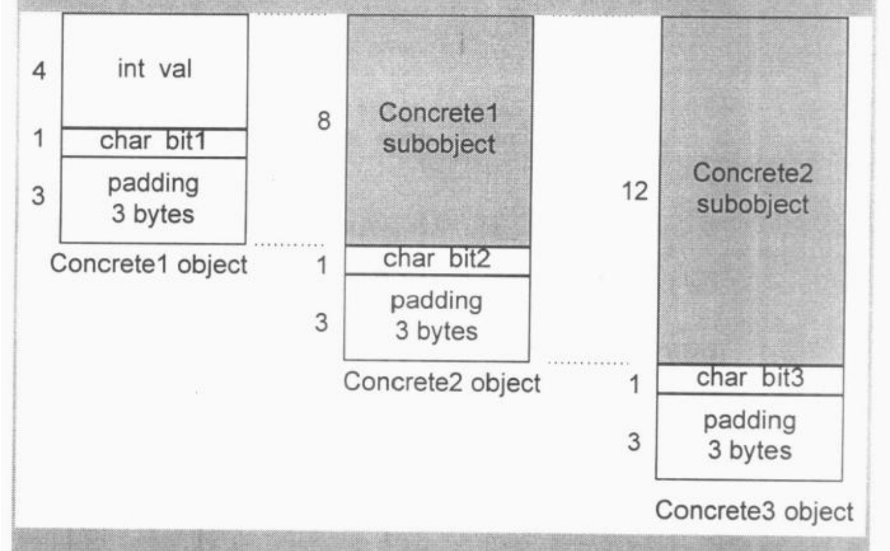
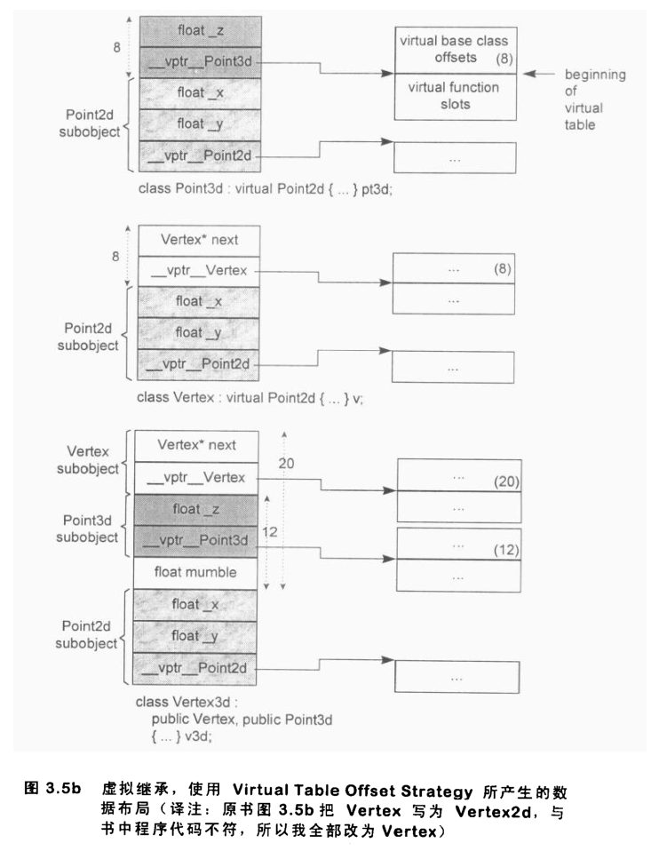
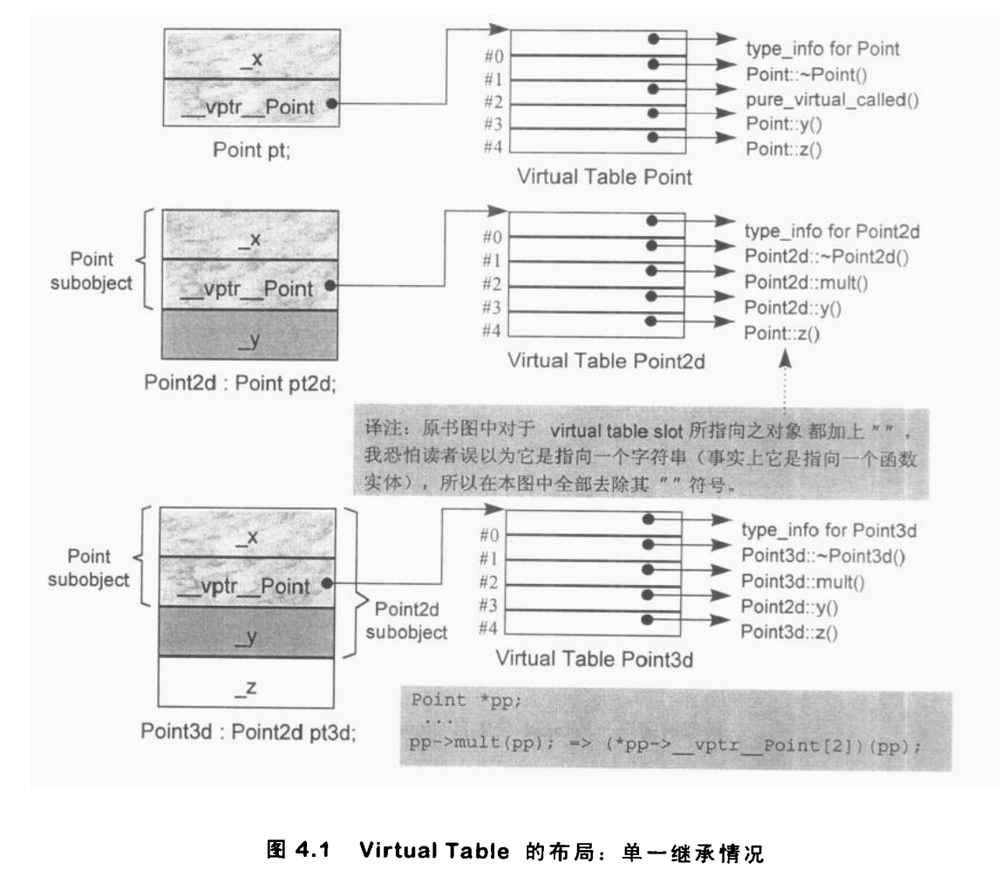
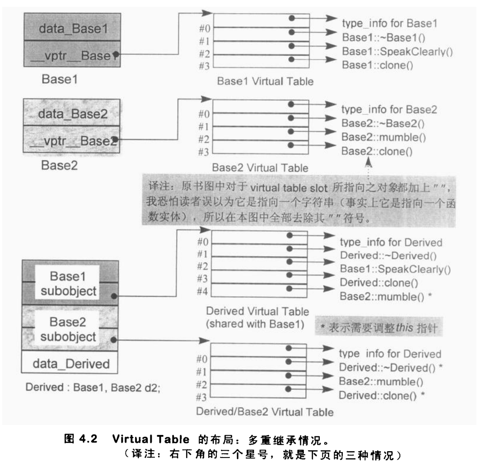
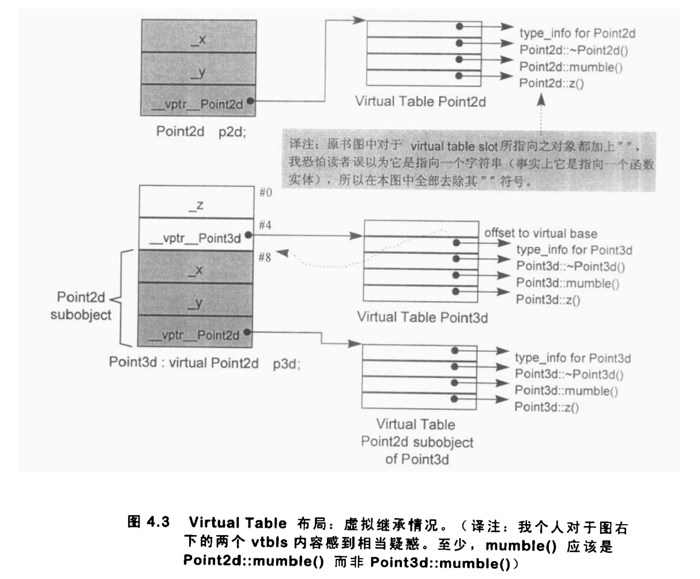

# 深入探索C++对象模型

# 第1章 关于对象

过程性语言：“数据”和“处理数据的操作（函数）”是分开来声明的。

C++在布局以及存取时间上主要的额外负担是由virtual引起的：

1. virtual function机制。用以支持一个运行期间绑定
2. virtual base class。用以实现“多次出现在继承体系中的base class，有一个单一被共享的实例”

## 1.1 C++对象模式

```c++
class Point{
public:
    Point(float xval);
    virtual ~Point();
    
    float x() const;
    static int PointCount();
    
protected:
	virtual ostream& print(ostream &os) const;
    
    float _x;
    static int _point_count;
};
```

### 简单对象模型


简单布局模型中，成员本身不放在object中，放的是成员指针，这是为了解决成员有不同类型，因此需要不同存储空间的问题。

优点：降低了编译器的设计复杂度

缺点：空间和执行期效率低

### 表格驱动对象模型


该模型将成员变量和成员函数分类，分为两个表格，而对象中包含着两个表格的**指针**

### C++对象模型


虚函数实现机制：

1. 每个类产生一堆指向虚函数的指针，放在表格中，这个表格被称为virtual table(vtbl)
2. 每个对象被安插一个指针，指向相关的virtual table。通常这个指针被称为vptr。vptr的setting和resetting都由每一个类的构造函数、析构函数和赋值运算符自动完成

优点：空间效率和存取时间的效率

缺点：对象的非静态成员发生改变，即使应用程序没有改变，代码也得重新编译

## 1.2 关键词所带来的差异

主要讲述struct和class在古老C++编译器上产生的问题，内容古老，所以没有记录

## 1.3 对象的差异

三种程序设计范式

1. 过程模型。
2. 抽象数据类型模型。此模型所谓的“抽象”是和一组表达式（public接口）一起提供的，其运算定义仍然隐而未明
3. 面向对象模型。在此模型中有一些彼此相关的类型，通过一个抽象的基类封装起来。


C++多态：

1. 经由一组隐式的转化操作。例如把一个derived class指针转化为一个指向其public base type的指针
2. virtual function机制
3. 经由dynamic_cast和typeid运算符


C++对象内存构成

1. 非静态数据成员大小之和
2. 数据之间为了对齐所用的空间
3. 为了支持虚函数机制产生的空间


### 指针的类型

不同类型的指针之间的差异在于寻址出来的对象类型不同，而不是指针表示方法和内容。【这是实现多态的本质】


```c++
class ZooAnimal{
public:
    ZooAnimal();
    virtual ~ZooAnimal();
    virtual void rotate();
    
protected:
    int loc;
    String name;
};
```

其内存布局：


加上子类

```c++
class Bear : public ZooAnimal{
public:
    Bear();
    ~Bear();
    
    void rotate();
    virtual void dance();
protected:
    enum Dances{...};			// 枚举值不占用对象空间，因为枚举属于类，而非对象
    Dances dances_know;
    int cell_block;
};
```


# 第2章 构造函数语意学

## 2.1 默认构造函数的构造操作

### 带有默认构造函数的成员类

如果一个class没有任何constructor，但它内含一个member object，而后者有default constructor，那么这个类的implicit default constructor就是nontrivial，编译器需要为该类合成一个default constructor。不过这个合成操作只有在constructor真正需要被调用时才会发生。

```c++
class Foo {public: Foo(), Foo(int)...};
class Bar {public: Foo foo; char *str;};

void foo_bar()
{
    Bar bar;	// Bar::foo必须在此处初始化
    if(str){ } ...
}
```

合成的Bar默认构造函数能够调用Foo的**默认构造函数**来处理Bar::foo成员，但是不会对Bar::str进行初始化，对Bar::str进行初始化是程序员的责任。

```c++
class Dopey {public: Dopey;...};
class Sneezy {public: Sneezy(int); Sneezy();...};
class Bashful {public: Bashful();...};

class Snow_White{
public:
    Snow_White():sneezy(1024)
    {
        mumble = 2048;
    }
    Dopey dopey;
    Sneezy sneezy;
    Bashful bashful;
    
private:
    int mumble;
};

// 编译器扩张后的默认构造函数
// C++伪代码
Snow_White::Snow_White:sneezy(1024)
{
    dopey.Dopey::Dopey();
    sneezy.Sneezy::Sneezy(1024);
    bashful.Bashful::Bashful();
    
    // explicit user code
    mumble = 2048;
}
```

### 带有默认构造函数的基类

如果一个没有任何构造函数的类派生自一个有默认构造函数的基类，则这个派生类的默认构造函数会被视为nontrivial，并需要被合成，合成的构造函数调用上一层基类的**默认构造函数**（根据它们的声明顺序）

如果子类中写明了构造函数，但是没有默认构造函数，编译器不会合成默认构造函数，只会在已有的构造函数中进行扩展，方便调用父类的**默认构造函数**

### 带有虚函数的类

另外两种情况需要合成默认构造函数

1. 类声明（或继承）一个虚函数
2. 类派生自一个继承链条，其中有至少一个的虚基类

对于派生自虚类的类

1. 产生vtbl，然后在里面放入类的virtual function地址
2. 每一个对象中，放入一个额外的指针变量，指向与该类相关的vtbl的地址

### 带有一个虚基类的类

```c++
class X {public: int i;};
class A: public virtual X{public: int j;};
class B: public virtual X{puclic: double d;};
class C: public A, public B {public: int k;};

// 无法在编译时期决定出pa->X::i的位置
void foo(const A* pa) {pa->i = 1024;}
```

原先cfront的做法是子类中的每一个虚父类中插入一个指针，指针指向virtual base class，foo函数被改写如下

```c++
void foo(const A* pa){pa->__vbcX->i = 1024;}
```

其中__vbcX表示编译器所产生的指针，指向virtual base class X。

经常会有2个误解：

1. 任何class如果没有定义默认构造函数，就会被合成出一个【写了构造函数，编译器不会构造默认构造函数】
2. 编译器合成出来的默认构造函数会显式设定类内的每一个数据成员默认值【编译器合成的构造函数只会调用父类或者成员类的默认构造函数，成员变量不会被初始化】


## 2.1 拷贝构造函数的构造操作

### Default Memberwise Initialization

如果类没有提供拷贝构造函数，使用一个对象初始化另一个对象时，都是将每一个内建的或派生的数据成员的值，从一个对象拷贝到另一个对象上。


### Bitwise Copy Semantics


一个类不展现bitwise copy semantics的情况：

1. 当类中有对象定义了拷贝构造函数
2. 当类继承自一个有拷贝构造函数的类
3. 当类声明了一个或多个虚函数的时候
4. 当类派生自一个继承串联，其中有一个或多个virtual base classes时

### 处理Virtual Base Class Subobject

一个对象以另一个对象为初值， 后者含有一个虚基类对象，则bitwise copy semantics失效


## 2.3 程序转化语意学

### 返回值的初始化

```c++
X bar()
{
    X xx;
    // 处理xx
    return xx;
}

// 函数转换，以反映出拷贝构造函数的一个额外参数
void bar(X& _result)
{
    X xx;
    xx.X::X();
    // 处理xx
    
    // 编译器所产生的copy constructor调用操作
    _result.X::X(xx);
    
    return;
}
```

### 在使用者层面做优化

定义一个计算用的constructor

```c++
X bar()
{
    X xx;
    // 以y和z来处理xx
    return xx;
}
```

这种情况，xx会被"memberwise"地拷贝到编译器产生的_result之中。可以另定义一个constructor，直接计算xx的值

```c++

X bar(const T &y, const T &z)
{
    return X(y,z);
}

// C++伪码
void bar(X &_result)
{
    _result.X::X(y, z);
    return;
}
```

### 在编译器层面做优化

编译器的优化就是使用result参数取代named return value

```c++
X bar()
{
    X xx;
    // 以y和z来处理xx
    return xx;
}
```

编译器会用_result取代xx

```c++
void bar(X& _result)
{
    // default constructor被调用
    // C++伪码
    _result.X::X();
    
    // ...直接处理_result
    
    return;
}
```

【P68中，拷贝构造函数激活了C++编译器中的NRV，其中的原因？】

### 拷贝构造函数：要还是不要？

如果一个函数以传值的方式传回一个对象，而该对象的类有一个拷贝构造函数，则编译器会进行优化，就是以一个额外的第一参数（数值直接存放于其中）取代NRV，

## 2.4 成员们的初始化列表

编译器会一一操作初始化列表，用适当的顺序在构造函数内部安插初始化操作，会**省略临时性对象**。

初始化的顺序是由类中成员的声明顺序决定的，而不是初始化列表中的顺序决定的。

初始化列表的执行会**早于**构造函数函数体。

```c++
X::X(int val): i(xfoo(val)), j(val)
{}
```

如果初始化列表需要调用成员函数初始化一个成员，则应该使用构造函数体内一个成员，而不是初始化列表中的成员


编译器会对初始化列表一一处理并可能重新排列，以反映成员的声明顺。它会安插一些代码到构造函数体内，并置于任何explicit user code之前

# 第3章 Data语意学

**空类的大小是1字节**，因为这使得类的两个对象在内存中配置独一无二的地址。

一个类的大小所受的影响

1. 语言本身所造成的额外负担，当语言支持virtual base classes时，就会导致一些额外的负担。
2. 编译器对特殊情况的优化处理
3. 对齐原则，在32位机器上，对齐的原则是4字节

## 3.1 成员变量的绑定

## 3.2 成员变量的布局

非静态成员变量在类对象中的排列顺序和声明的顺序一致，在任何中间插入静态成员变量都不会被放进对象布局之中。 

C++ Standard要求，在同一个access section(也就是private, public, protected等区段)中，members的排列只需符合"较晚出现的members在class object中有较高的地址"

## 3.3 成员变量的存取

### 静态成员变量

每一个静态成员变量只有一个实例，存放在程序的data segment之中。

若取一个static data member的地址，会得到一个指向其数据类型的指针，而不是指向其class member的指针，因为static member并不含在一个class object之中。

### 非静态成员变量

非静态成员变量直接存放在每一个class object之中。除非经由显式的或隐式的class object，否则没法直接存取它们。

欲对一个非静态成员变量进行存取操作，编译器需要把class object的起始地址加上data member的偏移位置。

```c++
&origin + (&Point3d::_y - 1);
```

指向data member的指针，其offset值总是被加上1，这样可以使编译系统区分出“一个指向data member的指针，用以指出class的一个member”和“一个指向data member的指针，没有指出任何member”两种情况。

每一个nonstatic data member的偏移位置在编译期即可获知。

```c++
origin.x = 0.0;
pt->x = 0.0;
```

这两种存取方式，如果当Point3d是一个derived class，而其继承结构中有一个virtual base class，并且被存取的member是一个从该virtual base class继承而来的member时，就会有重大的差异。

## 3.4 继承与Data Member

### 只要继承不要多态

继承不会填补padding空间，有以下类：

```c++
class Concrete1{
public:
    // ...
private:
    int val;
    char bit1;
};

class Concrete2: public Concrete1{
public:
    // ...
private:
    char bit2;
};

class Concrete3: public Concrete2{
public:
    // ...
private:
    char bit3;
};
```

则会有以下布局：


### 加上多态

引入虚函数所需要做的工作

1. 导入virtual table，用来存放每一个virtual function的地址
2. 在每个对象中引入vptr，提供执行期的链接，使每一个对象能够找到相对应的virtual table
3. 加强构造函数，使它能够初始化vptr
4. 加强析构函数，使它能够消除“指向class相关virtual table”的vptr

vptr放在对象的前端，优点是对于多重继承有帮助，缺点是不兼容C语言

### 多重继承

C++ Standard没有要求多重继承中base classes的排列顺序，原始的cfront编译器是根据声明顺序来排列。某些编译器设计了一种优化技术，只要第二个（或后继）base class声明了一个virtual function，而第一个base class没有，则把多个base classes的顺序调换。

### 虚拟继承

多重继承的一个语意上的副作用是，它必须支持某种形式的"shared subobject继承"。【其实就是菱形继承】

为了让编译器支持虚拟继承，一般方法如下：类中如果一个或多个virtual base class subobject，将被分割为两部分：一个不变区域和一个共享区域。不变区域中的数据，不管后继如何变化，总是拥有固定的offset，所以这一部分数据可以被直接存取。共享区域中，其位置会因为每次的派生操作而有变化，所以它们只能被间接存取。不同编译器的差别在于间接存取的方式。

#### cfront编译器

每一个derived class object中安插一些指针，每个指针指向一个virtual base class。要存取继承得来的virtual base class members，可以通过相关指针间接完成。【每个子类只指向其父类】

缺点：

1. 每一个对象必须针对其每一个virtual base class背负一个额外的指针。理想上我们希望class object有固定的负担，不会因为其virtual base classes的个数有所变化
2. 由于虚拟继承串联的加长，导致间接存取层次的增加。如果我有三层虚拟派生，我就需要三次间接存取，理想上我们希望有固定的存取时间，不因为虚拟派生的深度而改变

#### Microsoft编译器

引入virtual base table，每一个class object如果有一个或多个virtual base classes，就会由编译器安插一个指针，指向virtual base class table。至于真正的virtual base classes指针，就被放在表格中。

#### Bjarne

在virtual function table中放置virtual base class的offset。virtual function table可经由正值或负值来索引。如果是正值，很显然就是所引导virtual function，如果是负值，则是索引到virtual base class offsets。


 

## 3.6 指向Data Members的指针

# 第4章 Function语意学

## 4.1 Member的各种调用方式

### 非静态成员函数

C++的设计准则之一就是：非静态成员函数至少必须和一般的非成员函数有相同的效率。

将成员函数改为非成员函数的步骤：

1. 改写函数的signature，添加一个额外的参数到member function中，就是this指针
2. 将每一个非静态成员的存取操作改为经由this指针来存取
3. 将member function重新写成一个外部函数，将函数名称经过“mangling”处理，使它在程序中称为独一无二的语汇

### 虚拟成员函数

如果normalize()是一个virtual member function，那么以下调用

```c++
ptr->normalize();
```

会被转化为：

```c++
(*ptr->vptr[1])(ptr);
```

- vptr表示由编译器产生的指针，指向virtual table。它被安插在每一个“声明有（或继承自）一个或多个virtual functions”的class object中。事实上其名称也会被"mangled"，因为在一个复杂的派生体系中，可能存在多个vptrs
- 1是virtual table slot的索引值，关联到normalize()函数
- 第二个ptr表示this指针

### 静态成员函数

特点：

1. 不能够直接存取其class中的非静态成员，因为没有静态函数没有this指针
2. 不能够被声明为const, volatile, virtual
3. 不需要经由class object才被调用

## 4.2 虚拟成员函数【需要重新看】

### 单一继承

```c++
class Point{
public:
    virtual ~Point();
    
    virtual Point& mult(float) = 0;
    // ...其他操作
    
    float x() const {return _x;}
    virtual float y() const {return 0;}
    virtual float z() const {return 0;}
    // ...
protected:
    Point(float x = 0.0);
    float _x;
}
```



### 多重继承下的virtual functions

```c++
class Base1{
public:
    Base1();
    virtual ~Base1();
    virtual void speakClearly();
    virtual Base1 *clone() const;
 protected:
    float data_Base1;
}

class Base2{
public:
    Base2();
    virtual ~Base2();
    virtual void mumble();
    virtual Base2 *clone() const;
 protected:
    float data_Base2;
}

class Derived: public Base1, public Base2{
public:
    Derived();
    virtual ~Derived();
    virtual Derived *clone() const;
 protected:
    float data_Derived;
}
```

thunk技术：【感觉和前文的指针便宜没有啥区别，大概率是自己还没有理解透】

1. 以适当的offset值调整this指针
2. 调到virtual function去。

例如经由一个Base2指针调用Derived destructor

```c++
pbase2_dtor_thunk:
	this += sizeof(base1);
	Derived::~Derived(this);
```



### 虚拟继承下的virtual functions

```c++
class Point2d{
public:
    Point2d(float = 0.0, float = 0.0);
    virtual ~Point2d();
    
    virtual void mumble();
    virtual float z();
    // ...
protected:
    float _x, _y;
}

class Point3d : public virtual Point2d{
public:
    Point3d(float = 0.0, float = 0.0, float = 0.0);
    ~Point3d();
    
    float z();
protected:
    float _z;
}
```




不要在一个virtual base class中声明nonstatic data members。

## 4.3 函数的效能【需要重新看】

## 4.4 指向Member Function的指针

取一个nonstatic data member的地址，得到的结果是该member在class布局中的bytes位置（再加1）。

去一个nonstatic member function的地址，如果该函数是nonvirtual，得到的结果是它在内存中真正的地址。

### 支持“指向virtual member functions”的指针

```c++
float (Point::*pmf)() = &Point::z;
Point *ptr = new Point3d;
// 以下两个语句都能调用函数
ptr->z();
(ptr->*pmf)();
```

对一个nonstatic member function取地址，得到的是该函数在内存中的地址。

对一个virtual function取地址，所获得的只是一个索引值。因为其地址在编译期是未知的。

### 多重继承之下，指向Member Functions的指针

为了让指向member functions的指针也能够支持多重继承和虚拟继承，使用以下结构体

```c++
struct __mptr{
	int delta;
    int index;
    union{
        ptrtofunc faddr;
        int 	  v_offset;
    };
};
```

index和faddr分别不同时持有virtual table索引和nonvirtual member function地址

```c++
(ptr->*pmf)();

// 变成
(pmf.index < 0)
? // non-virtual invocation
(*pmf.faddr)(ptr)
: // virtual invocation
(*ptr->vptr[pmf.index](ptr));
```

## 4.5 Inline Function

处理一个inline函数，有两个阶：

1. 分析函数定义，以决定函数的“intrinsic inline ability”（本质的inline能力）
2. 真正的inline函数扩展操作是在调用的那一点上。这会带来参数的求值操作以及临时性对象的管理

### 形式参数

每一个形式参数都会被对应的实际参数取代。如果实参需要进行计算，则会引入临时性对象。

```c++
inline int min(int i, int j)
{
    return i < j ? i : j;
}

inline int bar()
{
    int minval;
    minval = min(foo(), bar() + 1);
}

// 展开为
int t1;
int t2;
minval = (t1 = foo()), (t2 = bar() + 1), t1 < t2 ? t1 : t2;
```

### 局部变量

# 第5章 构造、析构、拷贝语意学

```c++
class Abstract_base{
public:
    virtual ~Abstract_base() = 0;
    virtual void interface() const  = 0;
    virtual const char* mumble() const {return _mumble;}
protected:
    char *_mumble;
};
```

一般而言，class的data member应该被初始化，并且只在constructor中或是在class的其他member functions中指定初值。其他任何操作都会破坏封装性质，使class的维护和修改更加困难

### 纯虚函数的存在

纯虚函数可以被定义和静态调用，不能经由虚拟机制调用。纯虚析构函数必须要提供定义。

```c++
inline void Abstract_base::interface() const
{
    function
        // ...
}

inline void  Concrete_derived::interface() const
{
    // 静态调用
    Abstract_base::interface();
    // ...
}
```

### 重新考虑class的声明

```c++
class Abstract_base{
public:
    virtual ~Abstract_base() = 0;
    virtual void interface() = 0;
    virtual const char* mumble() const {return _mumble;}
protected:
    Abstract_base(char *pc = 0);	// 新增一个带有唯一参数的constructor
    char *_mumble;
};
```

## 5.1 "无继承"情况下的对象构造

## 5.2 继承体系下的对象构造

编译器扩充操作构造器的步骤：

1. 记录在成员初始化列表中的成员变量初始化操作会被放进构造函数的函数本体中，并以成员的声明顺序为顺序
2. 如果有一个成员没有出现在成员初始化列表中，但它有一个默认构造函数，那么该默认构造函数必须被调用
3. 在那之前，如果类对象有虚函数表指针，它们必须被设定初值，指向适当的虚函数表
4. 在那之前，所有上一层的基类构造函数必须被调用，以基类的声明顺序为顺序
   - 如果基类被列于成员初始化列表中，那么显式指定的参数都应该传递过去
   - 如果基类没有被列于成员初始化列表中，而它有默认构造函数，那么就调用
   - 如果基类是多重继承下的第二或后继的基类，那么this指针必须有所调整
5. 在那之前，所有virtual base class constructors必须被调用，从左到右，从最深到最浅
   - 如果class被列于成员初始化列表中，那么如果有任何显式指定的参数，都应该传递过去。若没有列于list中，而class有一个默认构造函数，则应该调用
   - 类中的每一个virtual base subobject的偏移位置必须在执行期可被存取
   - 如果class object是最底层的类，其构造函数可能被调用；某些用以支持这一行为的机制必须被放出来

```c++
class Point{
public:
    Point(float x = 0.0, float y = 0.0);
    Point(const Point&);
    Point& operator=(const Point&);
    
    virtual ~Point();
    virtual float z() {return 0.0;}
    // ...
protected:
    float _x, _y;
};
```


### 虚拟继承

```c++
class Point3d : public virtual Point{
public:
    Point3d(float x = 0.0, float y = 0.0, float z = 0.0):Point(x,y), _z(z){}
    Point3d(const Point3d& rhs):Point(rhs), _z(rhs.z){ }
    ~Point3d();
    Point3d& operator=(const Point3d&);
    
    virtual float z(){return _z;}
    // ...
protected:
    float _z;
};
```

有以下菱形继承关系：

```c++
class Vertex : virtual public Point{...};
class Vertex3d : public Point3d, public Vertex{...};
class PVertex : public Vertex3d{...};
```

如果按照之前继承构造顺序，则Point会被多次构造，所以会有一个变量bool __most_derived来控制Point的构造

```c++
// C++伪码：
// 在virtual base class情况下的constructor扩充内容
Point3d* Point3d::Point3d(Point3d *this, bool __most_derived, float x, float y, float z)
{
    if(__most_derived != false)
    {
        this->Point::Point(x, y);
    }
    this->__vptr_Point3d = __vtbl_Point3d;
    this->__vptr_Point3d_Point = __vtbl_Point3d_Point;
    this->_z = rhs.z;
    return this;
}

// C++伪码：
// 在virtual base class情况下的constructor扩充内容
Vertex3d* Vertex3d::Vertex3d(Vertex3d *this, bool __most_derived, float x, float y, float z)
{
    if(__most_derived != false)
    {
        this->Point::Point(x, y);
    }
    // 调用上一层的base classes
    // 设定__most_derived为false
    this->Point3d::Point3d(false, x, y, z);
    this->Vertex::Vertex(false, x, y);
    
    // 设定vptrs
    // 安插user code
    
    return this;
}
```

只有当一个完整的class object被定义出来，才会调用virtual base class constructors，如果object只是某个完整object的subobject，就不会被调用

定义一个PVertex object时，constructor的调用顺序是：

- Point(x,y);
- Point3d(x, y, z);
- Vertex(x, y, z);
- Vertex3d(x, y, z);
- PVertex(x, y, z);

### vptr初始化语意学

在Poin3d constructor中调用size()函数(虚函数)，必须被决议为Point3d::size()而不是PVertex::size()。在一个类（假设是Point3d）的构造函数中，经由构造函数中的对象来调用一个虚函数，其函数实例应该是在此类(本例为Point3d)中有作用的那个。

vptr初始化时机：base class constructors调用操作之后，在member initialization lis中所列的member初始化操作前。

```c++
PVertex::PVtertex(float x, float y, float z) : _next(0), Vertex3d(x, y, z), Point(x, y)
{
    if(spyOn)
    {
        cerr << "Within PVertex::PVertex()"
           << "size: " << size() << endl;
	}
};

// 上述代码被扩展为
// C++伪码
// PVertex constructor的扩展结果
PVertex* PVertex::PVertex(PVertex* this, bool __most_derived, float x, float y, float z)
{
    // 条件式的调用vitual base constructor
    if(__most_derived != false)
    {
        this->Point::Point(x, y);
    }
    
    // 无条件地调用上一层base
    this->Vertex3d::Vertex3d(x, y, z);
    
    // 将相关的vpter初始化
    this->__vptr_PVertex = __vbtl_PVertex;
    this->__vptr_Point_PVertex = __vbtl_Point_PVertex;
    
    // 程序员所写的代码
    if(spyOn)
    {
        cerr << "Within PVertex::PVertex()"
            << "size: "
            // 经由虚拟机制调用
            << (*this->__vptr_PVertex[3].faddr)(this)
            << endl;
	}
    
    // 传回被构造的对象
    return *this;
}
```

## 5.3 对象复制语意学

copy assignment operator缺乏一个member assignment list（类似于member initialization list），所以无法抑制上一层base class的copy operators被调用

```c++
inline Vertex3d& Vertex3d::operator=(const Vertex3d &v)
{
    this->Point::operator=(v);
    this->Point3d::operator=(v);
    this->Vertex::operator=(v);
}
```

编译器如何在Point3d和Vertex的copy assignment operator中抑制Point的copy assignment operators呢？

有一种方法可以保证most-derived class会引发virtual base class subobject的copy行为，就是在derived class的copy assignment operator函数实例的最后，显式调用那个operator，例如：

```c++
inline Vertex3d& Vertex3d::operator=(const Vertex3d &v)
{
    this->Point3d::operator=(v);
    this->Vertex::operator=(v);
    // must place this last if your compiler does
    // not suppress intermediate class invocations
    this->Point::operator=(v);
    ...
}
```


## 5.4 对象的效能

## 5.5 析构语意学

析构函数调用顺序

1. 析构函数本体首先被调用
2. 如果类拥有member class object，而后者拥有析构函数，那么它们会以其声明顺序的相反顺序被调用
3. 如果object内含一个vptr，现在被重新设定，指向适当的base class的virtual table

# 第6章 运行期语意学

## 6.1 对象的构造和析构

一般而言我们会把object尽可能放置在使用它的那个程序区段附近，这么做可以节省非必要的对象产生操作和摧毁操作。

### 全局对象

C++程序中所有的global objects都被放置在程序data segment中。如果显式指定给它一个值，此object将以该值为初值。否则object所配置到的内存内容为0。

静态初始化过程：

1. 为每一个需要静态初始化的文件产生一个_sti()函数，内含必要的constructor调用操作或inline expansions。
2. 在每一个需要静态的内存释放操作的文件中，产生一个_std()函数，内含必要的destructor调用操作，或是其中inline expansions。
3. 提供一组runtime library "munch"函数：一个_main()函数，用以调用可执行文件中所有的 _sti()函数，以及一个exit()函数


### 局部静态对象

局部静态对象只有函数被调用时进行构造。

### 对象数组

假设有如下数组定义：

```c++
Point knotes[10];
```

使用一个被命名为vec_new()的函数，产生出以class objects构造而成的数组

```c++
void* vec_new(
    void *array,							// address of start of array
	size_t elem_size,						// size of each class object
	int elem_count, 						// number of elements in array
	void (*constructor)(void*), 
	void (*desconstructor)(void*, char)
)
```

编译器针对10个Point元素所做的vec_new()调用操作：

```c++
Point knots[10];
vec_new(&knots, sizeof( Point ), 10, &Point::Point, 0);
```

数组的析构过程也是一个经由vec_delete()函数完成

```c++
void* vec_delete(
    void *array,							// address of start of array
	size_t elem_size,						// size of each class object
	int elem_count, 						// number of elements in array
	void (*desconstructor)(void*, char)
)
```

### Default Constructor和数组

上述的vec_new()函数缺陷在于无法处理带有默认参数的构造函数，当构造函数是`complex::complex(double = 0.0, double = 0.0);`时，无法处理，采取的解决方法是产生一个内部的stub constructor，没有参数

```c++
// 内部产生的stub constructor
// 用以支持数组的构造
complex::complex()
{
    complex(0.0, 0.0);
}
```

## 6.2 new和delete运算符

new 操作主要有两个步骤完成：

```c++
Point3d *origin = new Point3d;
```

会被转化为：

```c++
Point3d *origin;
// c++伪码
if(origin = __new(sizeof(Point3d)))		// 分配内存
{
    try
    {
        origin = Point3d::Point3d(origin);	// 使用构造函数
    }
    cache(...)
    {
        // 调用delete library function以释放因new而配置的内存
        __delete(origin);
        
        // 将原来的exception上传
        throw;
    }
}
```

### 针对数组的new语意

```c++
struct simple_aggr
{
    float f1, f2;
}

simple_aggr *p_aggr = new simple_aggr[5];
```

vec_new()不会被调用，因为simple_aggr没有定义一个constructor或desconstructor，所以只是单纯的获得内存和释放内存。如果class定义了一个default constructor，某些版本的vec_new()就会被调用。

delete[]只有当中括号出现时，编译器才寻找数组的维度，否则它便假设只有单独一个objects要被删除。**避免以一个base class指针指向一个derived class objects所组成的数组**，如果derived class object比其base大的话。

```c++
Point *ptr = new Point3d[10];

// 只有Point::~Point被调用...
delete[] ptr;
```

【即使调用了Point3d::~Point3d，还是有问题，因为sizeof(Point)和sizeof(Point3d)不同，第一个元素会成功释放，但是后续元素不会成功释放】

### Placement Operator new的语意

placement operator new **不会分配新内存**

```c++
void* operator new(size_t, void* p)
{
    return p;
}

Point2w *ptw = new (arena) Point2w;		// arena指向内存中的一个区块，用以放置新产生的Point2w object

// C++伪码
Point2w *ptw = new (Point2w) arena;
if(ptw != 0)
{
    ptw->Point2w::Point2w();
}
```

如果在已经存在一个对象的地址上构造新的对象，正确操作应该如下

```c++
Point2w *p2w = new (arena) Point2w;
// 调用析构函数而非使用delete，因为使用delete会删除已经分配的内存
p2w->~Point2w;
p2w = new (arena) Point2w;
```

placement new operator并不支持多态，

```c++
struct Base
{
    int j;
    virtual void f()
    {
        std::cout << "Base" << std::endl;
    }
};

struct Derived : Base
{
    void f() override
    {
        std::cout << "Derived" << std::endl;
    }
};

int main()
{
    Base b;
    b.f();
    b.~Base();
    new (&b) Derived;		// 父类和子类的大小一致
    b.f();					// 运行基类的函数
}
```

