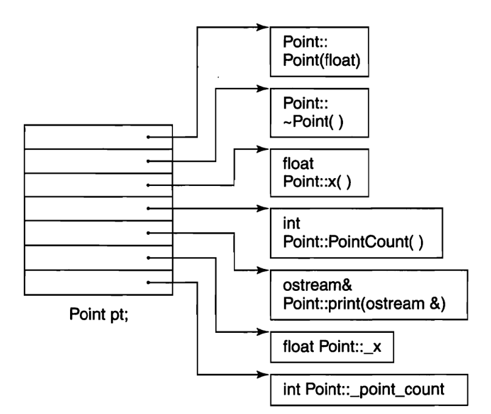
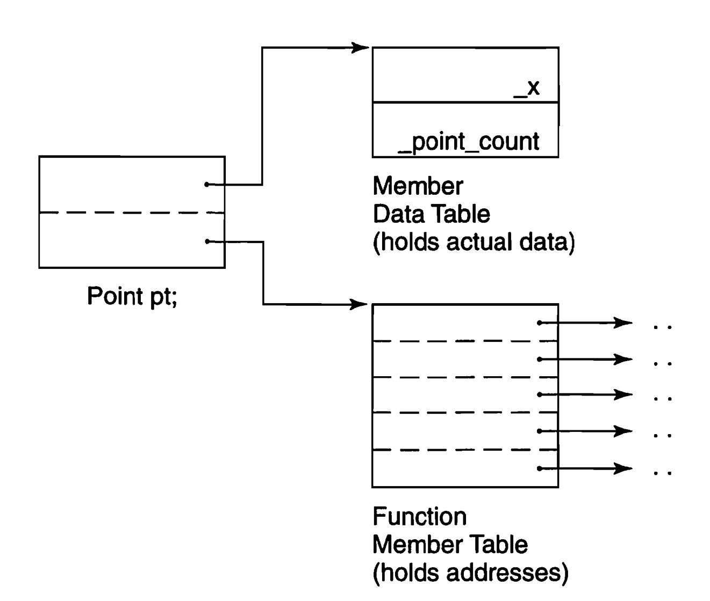
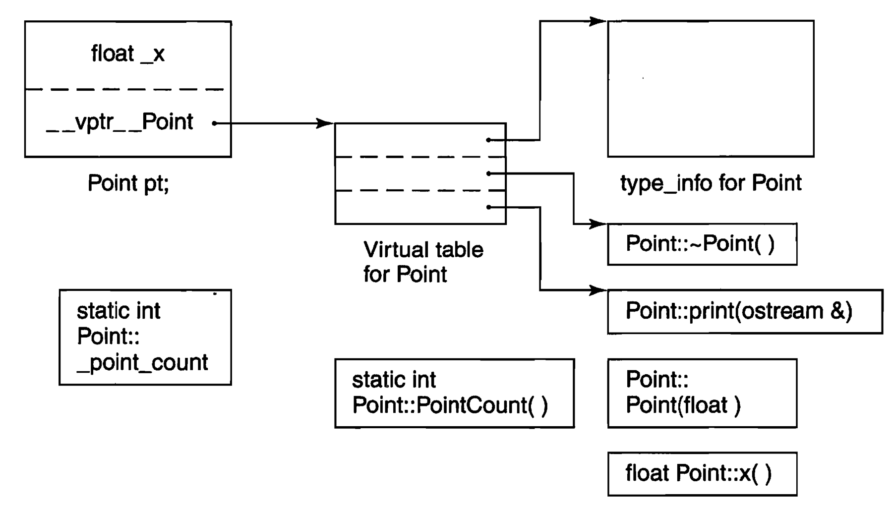
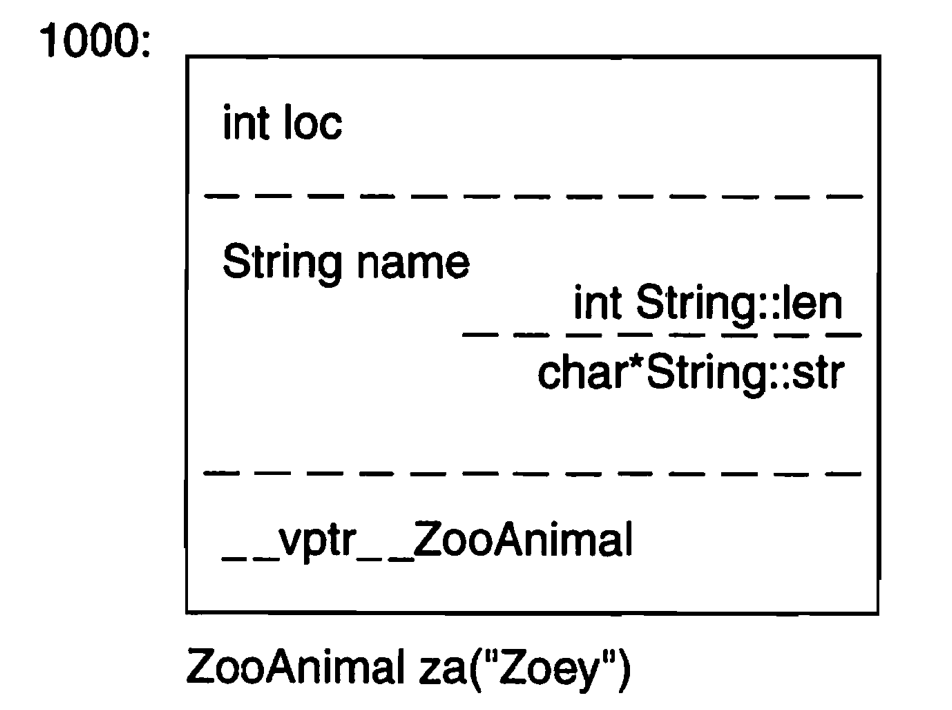
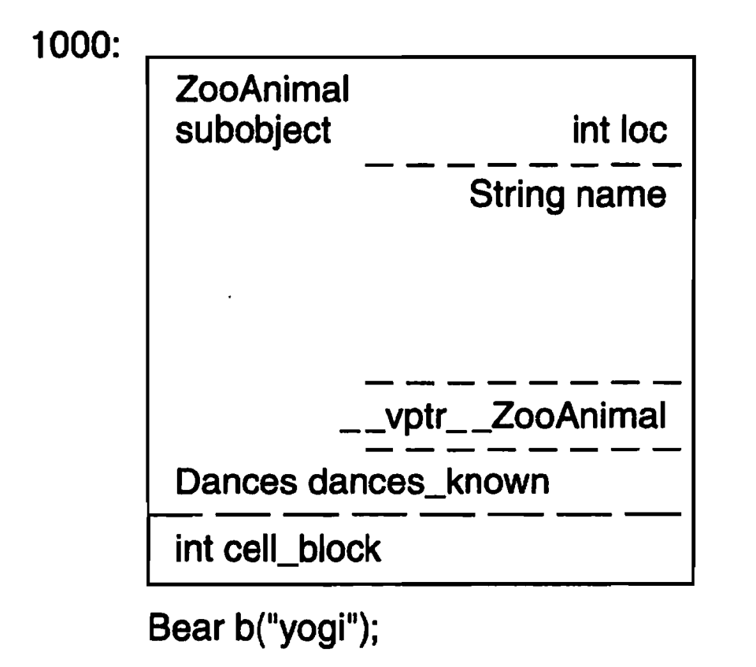

# 深入探索C++对象模型

# 第1章 关于对象

过程性语言：“数据”和“处理数据的操作（函数）”是分开来声明的。

C++在布局以及存取时间上主要的额外负担是由virtual引起的：

1. virtual function机制。用以支持一个运行期间绑定
2. virtual base class。用以实现“多次出现在继承体系中的base class，有一个单一被共享的实例”

## 1.1 C++对象模式

```c++
class Point{
public:
    Point(float xval);
    virtual ~Point();
    
    float x() const;
    static int PointCount();
    
protected:
	virtual ostream& print(ostream &os) const;
    
    float _x;
    static int _point_count;
};
```

### 简单对象模型



简单布局模型中，成员本身不放在object中，放的是成员指针，这是为了解决成员有不同类型，因此需要不同存储空间的问题。

优点：降低了编译器的设计复杂度

缺点：空间和执行期效率低

### 表格驱动对象模型



该模型将成员变量和成员函数分类，分为两个表格，而对象中包含着两个表格的**指针**

### C++对象模型



虚函数实现机制：

1. 每个类产生一堆指向虚函数的指针，放在表格中，这个表格被称为virtual table(vtbl)
2. 每个对象被安插一个指针，指向相关的virtual table。通常这个指针被称为vptr。vptr的setting和resetting都由每一个类的构造函数、析构函数和赋值运算符自动完成

优点：空间效率和存取时间的效率

缺点：对象的非静态成员发生改变，即使应用程序没有改变，代码也得重新编译

## 1.2 关键词所带来的差异

主要讲述struct和class在古老C++编译器上产生的问题，内容古老，所以没有记录

## 1.3 对象的差异

三种程序设计范式

1. 过程模型。
2. 抽象数据类型模型。此模型所谓的“抽象”是和一组表达式（public接口）一起提供的，其运算定义仍然隐而未明
3. 面向对象模型。在此模型中有一些彼此相关的类型，通过一个抽象的基类封装起来。


C++多态：

1. 经由一组隐式的转化操作。例如把一个derived class指针转化为一个指向其public base type的指针
2. virtual function机制
3. 经由dynamic_cast和typeid运算符


C++对象内存构成

1. 非静态数据成员大小之和
2. 数据之间为了对齐所用的空间
3. 为了支持虚函数机制产生的空间


### 指针的类型

不同类型的指针之间的差异在于寻址出来的对象类型不同，而不是指针表示方法和内容。【这是实现多态的本质】


```c++
class ZooAnimal{
public:
    ZooAnimal();
    virtual ~ZooAnimal();
    virtual void rotate();
    
protected:
    int loc;
    String name;
};
```

其内存布局：



加上子类

```c++
class Bear : public ZooAnimal{
public:
    Bear();
    ~Bear();
    
    void rotate();
    virtual void dance();
protected:
    enum Dances{...};			// 枚举值不占用对象空间，因为枚举属于类，而非对象
    Dances dances_know;
    int cell_block;
};
```



