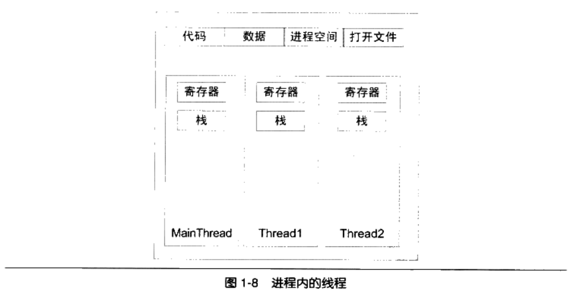
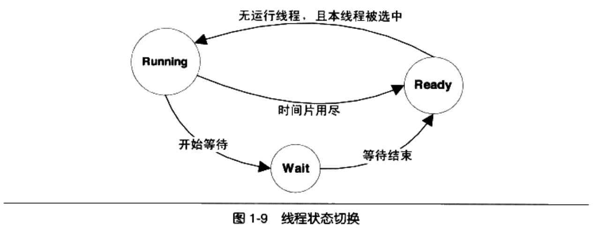
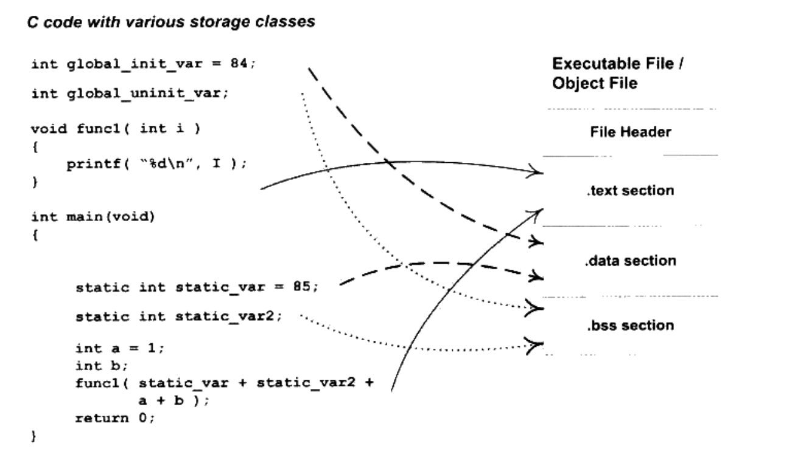
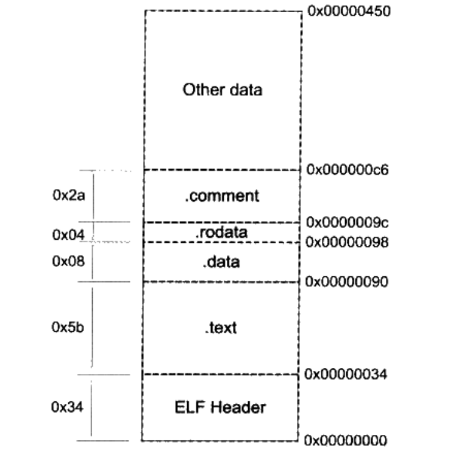
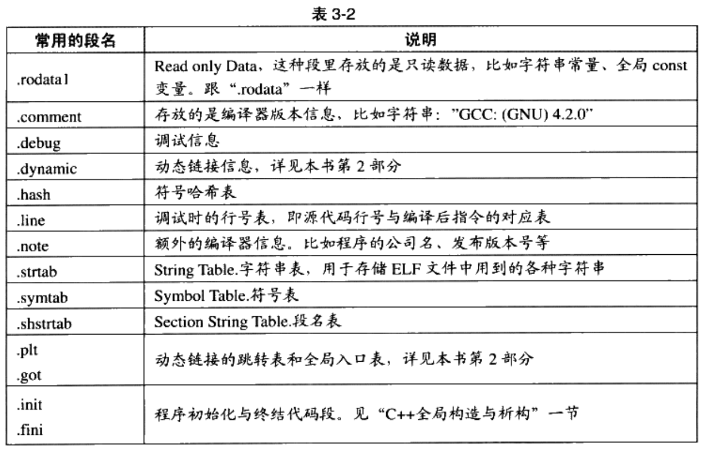
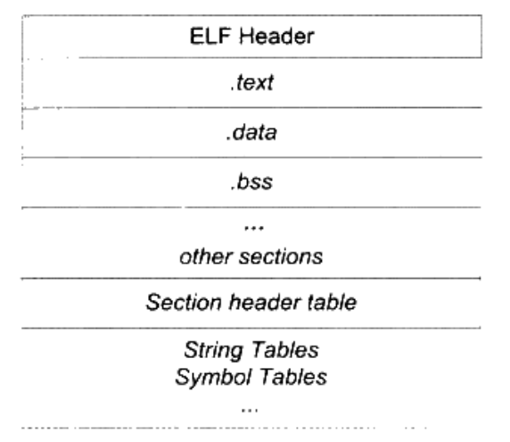
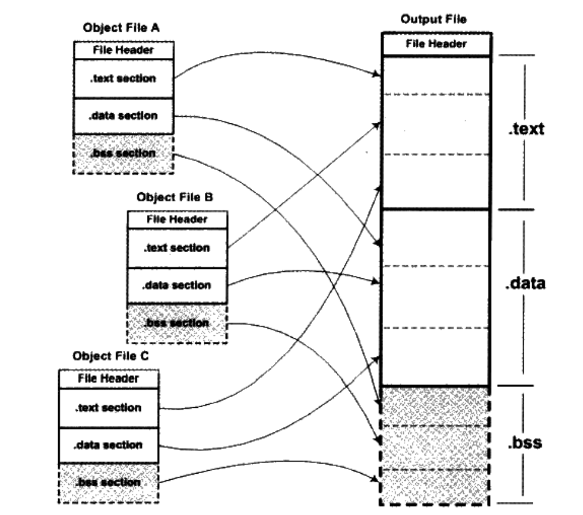
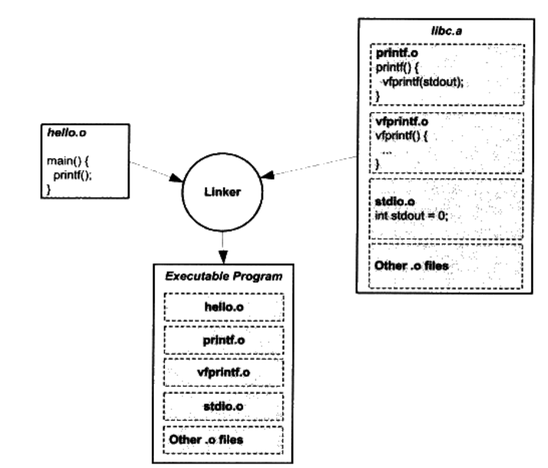

# 程序员的自我修养--链接、装载与库

# 第1章 温故而知新

## 1.2 万变不离其宗

计算机硬件结构发展：

1. CPU核心频率不高，和内存频率相同，此时所有设备都是连接在同一个总线上
2. 由于CPU核心频率提升，CPU采用倍频的方式与系统总线进行通信
3. 随着3D和多媒体的发展，为了协调CPU、内存和高速的图形设备，又专门设计了北桥芯片，以便高速交换数据
4. 又设计了南桥芯片专门处理磁盘、USB、键盘和鼠标等低速设备

## 1.3 站得高，望得远

Any problem in computer science can be solved by another layer of indirection.

计算机系统软件采用一种层的结构，每个层次之间都需要相互通信，通信的协议称为接口。

## 1.4 操作系统做什么

操作系统的一个功能是提供抽象接口，另外一个主要功能是管理硬件资源。

### 1.4.1 不要让CPU打盹

操作系统演变：

1. 多道程序：当某个程序无需使用CPU时，监控程序就把另外正在等待CPU资源的程序启动，使得CPU能够充分利用起来。
2. 分时系统：每个程序运行一段时间以后都主动让出CPU给其他程序，使得一段时间内每个程序都有机会运行一小段时间。
3. 多任务系统：操作系统接管了所有硬件，并且本身运行在一个受硬件保护的级别。所有的应用程序都以进程的方式运行在比操作系统权限更低的级别，每个进程都有自己独立的地址空间，使得进程之间的地址空间相互隔离。

### 1.4.2 设备驱动

计算机繁琐的硬件细节都交给了操作系统中的硬件驱动程序来完成。驱动程序往往可以看作是操作系统的一部分，它往往跟操作系统内核一起运行在特级权级，但它又与操作系统内核之间有一定的独立性。

## 1.5 内存不够怎么办

使用物理地址的缺陷：

- 地址空间不隔离，恶意程序可以修改其他程序的内存数据
- 内存使用效率低。在运行程序过程中，会有大量的数据换入和换出，导致效率低下
- 程序运行地址不确定。程序在编写时，访问数据和指令跳转时的目标地址很多是固定的，每次装入程序时，空闲区域都是不确定的，所以形成了矛盾

解决思路就是使用呢虚拟地址，然后使用某种映射的方法，将虚拟地址映射称为物理地址。

### 1.5.1 关于隔离

地址空间分为两种：虚拟地址空间和物理地址空间。

### 1.5.2 分段

将一段程序所需要的内存空间大小的虚拟空间映射到某个地址空间。虚拟空间中的每个字节相对应于物理空间中的每个字节。这个映射有软件来设置，实际的地址转换由硬件完成。【地址映射和地址转换的区别？】

分段解决了物理内存缺陷的1和3，但是没有解决内存使用效率问题。

### 1.5.3 分页

首先根据局部性原理，当一个程序运行时，在某个时间段内，它只是频繁的用到了一小部分数据，由此产生了分页这种更小颗粒度的内存分割和映射的方法。

对于一个操作系统来说，页的大小是固定的，从4KB到4MB。操作系统会把进程的虚拟地址空间按照页分割，把常用的数据和代码装载到内存中，把不常用的代码和数据保存在磁盘中。

当所需要的也不在内存中时，硬件会捕获到消息，就是页错误，然后操作系统接管进程，负责将缺少的页从磁盘中读出放入内存


虚拟存储需要硬件的支持，硬件部分叫做MM(Memory Management Unit)，CPU发出的是虚拟地址，经过MMU转换以后就变成了物理地址，一般MMU都集成在了CPU内部。

## 1.6 众人拾柴火焰高

### 1.6.1 线程基础

多线程作为实现软件并发执行的一个重要的方法。

一个标准线程有线程ID、当前指令指针(PC)、寄存器集合和堆栈组成。一个进程由一个到多个线程组成，各个线程之间共享程序的内存空间（包括代码段、程序段、堆等）及一些进程级的资源（如打开文件和信号）。



多线程优点：

1. 某个操作会陷入长时间等待，等待的线程会进入睡眠状态，无法继续进行。多线程可以有效利用等待时间。
2. 某个操作会消耗大量时间，多线程可以让一个线程负责交互，另一个线程负责计算。
3. 程序逻辑本身就要求并发操作
4. 多CPU或多核计算机，本身就具备同时执行多个线程的能力
5. 相对于多进程应用，多线程在数据共享方面效率要高很多

线程访问权限，Thread Local Storage(TLS)


一个处理器切换不同线程的行为称之为线程调度，线程调度中线程至少拥有三种状态，分别是

- 运行，线程正在执行
- 就绪，此时线程可以立即运行，但是CPU已经被占用
- 等待，线程正在等待某一事件发生，无法执行



IO密集型线程总是比CPU密集型线程容易得到优先级提升。

线程优先级改变一般有三种方式：

1. 用户指定优先级
2. 根据进入等待状态的频繁程度提升或降低优先级
3. 长时间得不到执行而被提升优先级

#### Linux的多线程

Linux多线程的创建有三种方式

1. fork，fork采用的是写时复制策略，而不是复制原任务的内存空间，只有当一个任务试图对内存进行修改的时候，内存才会复制一份提供给修改方单独使用

   ```c
   pid_t pid;
   if(pid = fork())
   {
       ...
   }
   ```

2. exec

3. clone

   ```c
   int clone(int(*fn)(void*), void* child_stack, int flags, void* arg);
   ```

### 1.6.2 线程安全

#### 竞争与原子操作

原子操作：单指令操作称为原子的，因为无论如何，单条指令的执行是不会被打断的。

#### 同步与锁

同步：在一个线程访问数据未结束的时候，其他线程不得对同一个数据进行访问，此时数据的访问被原子化了。

锁：线程在访问数据或资源之前试图获取锁，在访问后释放锁

信号量：初值为N的信号量允许N个线程并发访问。信号量的使用过程如下

- 将信号量减1
- 如果信号量的值小于0，则进入等待状态，否则继续执行。访问资源之后，线程释放信号量，进行如下操作
- 将信号量的值加1
- 如果信号量的值小于1，唤醒一个等待中的线程

互斥量：资源仅允许一个线程访问，互斥量要求获取和释放互斥量是同一个线程

临界区：把临界区的锁的获取称为进入临界区，把锁的释放称为离开临界区

读写锁：对于一段数据，多个线程同时读取时没有问题的，但是要修改数据，则要使用同步手段

条件变量：

#### 可重入与线程安全

可重入条件：

1. 不使用任何（局部）静态或全局的非const变量
2. 不返回任何（局部）静态或全局的非const变量的指针
3. 仅依赖于调用方提供的参数
4. 不依赖任何单个资源的锁
5. 不到用任何不可重入的函数

可重入是并发安全的强力保障。

### 1.6.3 多线程内部情况

#### 三种线程模型

1. 一对一模型，一个用户线程对应一个内核线程，该模型可以让多线程程序在多处理器的系统上有更好的表现，但是有缺点：1操作系统限制了内核线程数量，所以会限制用户线程数量，2上下文开销较大，导致用户线程的执行效率下降
2. 多对一模型，但是其中一个用户线程阻塞，所有的线程都将无法执行
3. 多对多模型，结合了一对一和多对一模型的特点，

# 第2 章 编译和链接

## 2.1 被隐藏的过程

编译过程一般分为4个步骤，预处理、编译、汇编和链接

### 2.1.1 预编译

预编译处理规则：

1. 将所有的#define删除，并且展开所有的宏定义
2. 处理所有条件预编译指令，比如#if, #ifdef, #elif, #else, #endif
3. 处理#include 预编译指令，将被包含的文件插入到该预编译指令的位置
4. 删除所有注释
5. 添加行号和文件名标识
6. 保留所有的#pragma编译器指令

### 2.1.2 编译

编译就是把预处理完的文件进行一系列词法分析、语法分析、语义分析及优化后产生响相应的汇编代码文件

### 2.1.3 汇编

汇编是将汇编代码转变成机器指令，

### 2.1.4 链接


## 2.2 编译器做了什么

### 2.2.1 词法分析

运用一种类似于有限状态机的算法可以很轻松地将源代码的字符序列分割成一系列的记号。

### 2.2.2 语法分析

对记号进行语法分析，从而产生语法树。

### 2.2.3 语义分析

判断这个语句是否有意义，经过语义分析阶段，整个语法树的表达式都被标识了类型。

### 2.2.4 中间语言生成

中间代码使得编译器可以被分为前后端，编译器前端负责产生机器无关的中间代码，编译器后端将中间代码转换成目标机器代码

### 2.2.5 目标代码生成与优化

编译器后端主要包括代码生成器和目标代码优化器。

## 2.3 链接器年龄比编译器长

模块之间如何组合的问题可以归结为模块之间如何通信的问题。C/C++模块之间通信有两种方式，一种是模块间的函数调用，二是模块间的变量访问

## 2.4 模块拼装——静态链接

链接过程主要包括地址和空间分配、符号决议和重定位

# 第3章 目标文件里有什么

## 3.1 目标文件的格式

现在PC平台流行的可执行文件主要是Windows下的PE(Portable Executable)和Linux的ELF(Executable Linkable Format)，它们都是COFF(Common file format)格式的变种。

不光是可执行文件，动态链接库(Dynamic Linking Library, DLL)(Windows的.dll和Linux的.so)及静态链接库(Static Linking Librayr)(Windows的.lib和Linux的.a)文件都按照可执行文件格式存储。

## 3.2 目标文件是什么样的




elf文件的开头是一个“文件头”，描述了整个文件的文件属性，包括文件是否可执行、是静态链接还是动态链接及入口地址，目标硬件、目标操作系统等信息。

执行语句都放在.text段，初始化的全局变量和局部静态变量都保存在.data段；未初始化的全局变量和局部静态变量一般放在一个交.bss段。如果给全局变量或者静态变量赋值0，则也保存在.bss段。

程序源代码被编译后主要分成两段：程序指令和程序数据。代码段属于程序指令，而数据和.bss段属于程序数据。

程序和数据分开的原因：

1. 程序和数据的权限不同，程序一般不会修改，数据一般会修改
2. 分区有利于提高程序的局部性，从而使CPU缓存命中率提高
3. 有多个程序副本时，可以只在内存中保存一份程序指令，节省内存

## 3.3 挖掘SimpleSection.o



SimpleSection.o的还包含了只读数据段(.rodata)、注释信息段(.comment)、堆栈提示段(.note.GNU-stack)

### 3.3.1 代码段

### 3.3.2 数据段和只读数据段

.data保存初始化了的全局静态变量和局部静态变量。有时候编译器会把字符串常量放到.data段，而不会单独放在.rodata段

### 3.3.3 BSS段

有些编译器会将全局的未初始化变量存放在目标文件的.bss段，有些则不放，只是预留一个未定义的全局变量符号。

### 3.3.4 其他段



**自定义段**

可以指定变量所处的段

```c
__attribute__((section("FOO"))) int global = 42;
__attribute__((section("BAR"))) void foo()
{
}
```


## 3.4 ELF文件结构描述



### 3.4.1 文件头

查看文件头命令

```bash
readelf -h SimpleSection.o
```

ELF的文件头中定义了ELF魔数、文件机器字节长度、数据存储方式（大小端）、版本、运行平台、ABI版本、ELF重定位类型、硬件平台、硬件平台版本、入口地址、程序头入口和长度、段表的位置及段的数量等。

魔数用来确认文件的类型，操作系统在加载可执行文件的时候会确认魔数是否正确，不过不正确会拒绝加载。

### 3.4.2 段表

```bash
readelf -S SimpleSection.o
```

段表就是保存这些段的基本属性的结构，描述了ELF的各个段的信息。

段的名字只是在链接和编译过程中有意义，段的名字无法决定段的属性，决定段的属性的是段的类型(sh_type)和段的标志位(sh_flags)

### 3.4.3 重定位表

重定位信息都记录在ELF文件的重定位表里，对于每个须要重定位的代码或数据段，都会有一个相应的重定位表。".rel.text"即使重定位段。

### 3.4.4 字符串表

字符串表用来保存普通的字符串，比如符号的名字；段表字符串表用来保存段表中用到的字符串，最常见的就是段名。

## 3.5 链接的接口——符号

可以将符号看作是链接中的粘合剂，整个链接过程正是基于符号才正确完成。符号表中的符号有以下几类

- 定义在本目标文件中的全局符号，可以被其他目标文件引用
- 在本目标文件中引用的全局符号，却没有定义在本目标文件中
- 段名，这种符号往往由编译器产生，它的值就是该段的起始地址
- 局部符号，这种符号只在编译单元内部可见
- 行号信息，即目标文件指令与源代码中代码行的对应关系

### 3.5.1 ELF符号表结构


### 3.5.2 特殊符号

有代表性的特殊符号

- __executable_start，为程序起始地址
- __etext或 _etext或etext，代码段结束地址
- __edata或edata，数据段结束地址
- _end或end，程序结束地址

### 3.5.3 符号修饰与函数签名

C++使用符号修饰来实现函数重载，函数签名是包含了函数名、参数类型、所在的类的名称空间和其他信息

### 3.5.4 extern "C"

C++编译器会将在extern "C"的大括号内部的代码当做C语言代码处理。

### 3.5.5 强符号与弱符号

编译器默认函数和初始化了的全局变量为强符号，未初始化的全局变量为弱符号。可以通过GCC的"__ attribute __ ((weak))"来定义任何一个强符号为弱符号。强弱符号规则

1. 不允许强符号被多次定义
2. 如果一个符号在某个目标文件中是强符号，在其他文件中是弱符号，那么选择强符号
3. 如果一个符号在所有的目标文件中都是弱符号，那么选择其中占用空间最大的一个


## 3.6 调试信息


# 4 静态链接

## 4.1 空间与地址分配

可执行文件中的代码和数据段都是由输入的目标文件中合并而来的。

### 4.1.1 按序叠加

直接将各个目标文件依次合并，但是会造成很多空间浪费，因为每个段都需要有一定的地址和空间对齐要求。

### 4.1.2 相似段合并

相似段合并是实际的空间分配策略



.bss段在目标文件和可执行文件中并不占用文件的空间，但是它在装载时占用地址空间。

链接过程分为

1. 空间与地址分配。链接器能够获得所有输入目标文件的段长度，并且将它们合并，计算出文件中各个段合并后的长度与位置，并建立映射关系
2. 符号解析与重定位。

### 4.1.3 符号地址的确定

## 4.2 符号解析与重定位

### 4.2.1 重定位

编译器将重定位的地址用暂时的地址代替，然后链接器计算真正的地址。

### 4.2.2 重定位表

查看目标文件的重定位表

```bash
objdump -r a.o		
```

### 4.2.3 符号解析

```bash
readelf -s a.o
```

其中符号前有 UND，就表示该符号是未定义的，应该能够在全局符号表中找到，否则链接器就报符号未定义的错误

### 4.2.4 指令修正方式


## 4.3 COMMON块

如果该编译单元中包含了弱符号，那么该弱符号最终所占有的空间此时是未知的，只有在所有文件输入完毕后，才知道该弱符号的空间大小，所以会在最终输出文件的BSS为其分配空间。所以最终未初始化的全局变量会被放在BSS段

## 4.4 C++相关问题

### 4.4.1 消除重复代码

模板、外部内联函数和虚函数表都有可能在不同的编译单元里生成相同的代码。此时重复代码会带来缺陷

- 空间浪费
- 地址易出错，有可能两个指向同一个函数的指针会不相等
- 指令运行效率低，如果一份指令有多个副本，那么指令Cache的命中率就会降低

一个有效的解决方法是将每个模板的实例代码都单独地存放在一个段里，每个段只包含一个模板实例。

**函数级别链接**：让所有的函数单独保存到一个段里，当链接器需要用到某个函数时，就将它合并输出到文件中，对于哪些没有用的函数则抛弃。虽然可以减少空间的浪费，但是会减慢编译和链接过程。

### 4.4.2 全局构造与析构


1. .init该段里保存的是可执行指令，它构成了进程的初始化代码
2. .fini该段保存着进程终止代码指令。

### 4.4.3 C++与ABI

如果两个编译器编译出来的目标文件能够互相链接，则必须满足一下条件：采用相同的目标文件格式，拥有同样的符号修饰标准，变量的内存分布方式相同，函数的调用方式相同，如果这些都兼容，则成为ABI(Application Binary Interface)可执行代码二进制兼容。

## 4.5 静态库链接



## 4.6 链接过程控制（暂时用不到，跳过）

## 4.7 BFD库

BFD库(Binary File Descriptor library)，目标是希望通过一种统一的接口来处理不同的目标文件格式。

# 5 Windows PE/COFF

## 5.1 Windows的二进制文件格式PE/COFF

PE文件格式和ELF格式都是来自于COFF(Common Object File Format)发展而来。

## 5.2 PE的前身——COFF

windows也可以使用命令行进行编译

```shell
cl /c /Za SimpleSection.c
```

cl表示Visual C++的编译器，/c表示只编译，不链接，/Za表示禁用C和C++语言的专用扩展，这些扩展没有定义ANSI C标准或ANSI C++标准。编译完之后可以得到SimpleSection.obj这个目标文件，

```shell
dumpbin /ALL SimpleSection.obj > SimpleSection.txt
```

dumpbin是Visual C++提供的一个用于查看目标文件和可执行文件的工具，/ALL是将打印输出目标文件的所有相关信息，包括头文件、每个段的属性和段的原始数据及符号表。
