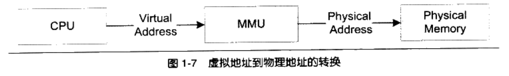

# 程序员的自我修养--链接、装载与库

# 第1章 温故而知新

## 1.2 万变不离其宗

计算机硬件结构发展：

1. CPU核心频率不高，和内存频率相同，此时所有设备都是连接在同一个总线上
2. 由于CPU核心频率提升，CPU采用倍频的方式与系统总线进行通信
3. 随着3D和多媒体的发展，为了协调CPU、内存和高速的图形设备，又专门设计了北桥芯片，以便高速交换数据
4. 又设计了南桥芯片专门处理磁盘、USB、键盘和鼠标等低速设备

## 1.3 站得高，望得远

Any problem in computer science can be solved by another layer of indirection.

计算机系统软件采用一种层的结构，每个层次之间都需要相互通信，通信的协议称为接口。

## 1.4 操作系统做什么

操作系统的一个功能是提供抽象接口，另外一个主要功能是管理硬件资源。

### 1.4.1 不要让CPU打盹

操作系统演变：

1. 多道程序：当某个程序无需使用CPU时，监控程序就把另外正在等待CPU资源的程序启动，使得CPU能够充分利用起来。
2. 分时系统：每个程序运行一段时间以后都主动让出CPU给其他程序，使得一段时间内每个程序都有机会运行一小段时间。
3. 多任务系统：操作系统接管了所有硬件，并且本身运行在一个受硬件保护的级别。所有的应用程序都以进程的方式运行在比操作系统权限更低的级别，每个进程都有自己独立的地址空间，使得进程之间的地址空间相互隔离。

### 1.4.2 设备驱动

计算机繁琐的硬件细节都交给了操作系统中的硬件驱动程序来完成。驱动程序往往可以看作是操作系统的一部分，它往往跟操作系统内核一起运行在特级权级，但它又与操作系统内核之间有一定的独立性。

## 1.5 内存不够怎么办

使用物理地址的缺陷：

- 地址空间不隔离，恶意程序可以修改其他程序的内存数据
- 内存使用效率低。在运行程序过程中，会有大量的数据换入和换出，导致效率低下
- 程序运行地址不确定。程序在编写时，访问数据和指令跳转时的目标地址很多是固定的，每次装入程序时，空闲区域都是不确定的，所以形成了矛盾

解决思路就是使用呢虚拟地址，然后使用某种映射的方法，将虚拟地址映射称为物理地址。

### 1.5.1 关于隔离

地址空间分为两种：虚拟地址空间和物理地址空间。

### 1.5.2 分段

将一段程序所需要的内存空间大小的虚拟空间映射到某个地址空间。虚拟空间中的每个字节相对应于物理空间中的每个字节。这个映射有软件来设置，实际的地址转换由硬件完成。【地址映射和地址转换的区别？】

分段解决了物理内存缺陷的1和3，但是没有解决内存使用效率问题。

### 1.5.3 分页

首先根据局部性原理，当一个程序运行时，在某个时间段内，它只是频繁的用到了一小部分数据，由此产生了分页这种更小颗粒度的内存分割和映射的方法。

对于一个操作系统来说，页的大小是固定的，从4KB到4MB。操作系统会把进程的虚拟地址空间按照页分割，把常用的数据和代码装载到内存中，把不常用的代码和数据保存在磁盘中。

当所需要的也不在内存中时，硬件会捕获到消息，就是页错误，然后操作系统接管进程，负责将缺少的页从磁盘中读出放入内存

虚拟存储需要硬件的支持，硬件部分叫做MM(Memory Management Unit)，CPU发出的是虚拟地址，经过MMU转换以后就变成了物理地址，一般MMU都集成在了CPU内部。

## 1.6 众人拾柴火焰高

### 1.6.1 线程基础

多线程作为实现软件并发执行的一个重要的方法。

一个标准线程有线程ID、当前指令指针(PC)、寄存器集合和堆栈组成。一个进程由一个到多个线程组成，各个线程之间共享程序的内存空间（包括代码段、程序段、堆等）及一些进程级的资源（如打开文件和信号）。

多线程优点：

1. 某个操作会陷入长时间等待，等待的线程会进入睡眠状态，无法继续进行。多线程可以有效利用等待时间。
2. 某个操作会消耗大量时间，多线程可以让一个线程负责交互，另一个线程负责计算。
3. 程序逻辑本身就要求并发操作
4. 多CPU或多核计算机，本身就具备同时执行多个线程的能力
5. 相对于多进程应用，多线程在数据共享方面效率要高很多

线程访问权限

一个处理器切换不同线程的行为称之为线程调度，线程调度中线程至少拥有三种状态，分别是

- 运行，线程正在执行
- 就绪，此时线程可以立即运行，但是CPU已经被占用
- 等待，线程正在等待某一事件发生，无法执行

IO密集型线程总是比CPU密集型线程容易得到优先级提升。