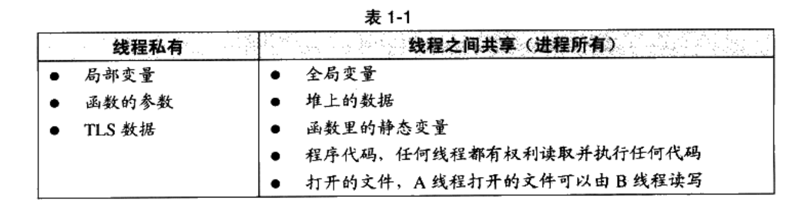

# 程序员的自我修养--链接、装载与库

# 第1章 温故而知新

## 1.2 万变不离其宗

计算机硬件结构发展：

1. CPU核心频率不高，和内存频率相同，此时所有设备都是连接在同一个总线上
2. 由于CPU核心频率提升，CPU采用倍频的方式与系统总线进行通信
3. 随着3D和多媒体的发展，为了协调CPU、内存和高速的图形设备，又专门设计了北桥芯片，以便高速交换数据
4. 又设计了南桥芯片专门处理磁盘、USB、键盘和鼠标等低速设备

## 1.3 站得高，望得远

Any problem in computer science can be solved by another layer of indirection.

计算机系统软件采用一种层的结构，每个层次之间都需要相互通信，通信的协议称为接口。

## 1.4 操作系统做什么

操作系统的一个功能是提供抽象接口，另外一个主要功能是管理硬件资源。

### 1.4.1 不要让CPU打盹

操作系统演变：

1. 多道程序：当某个程序无需使用CPU时，监控程序就把另外正在等待CPU资源的程序启动，使得CPU能够充分利用起来。
2. 分时系统：每个程序运行一段时间以后都主动让出CPU给其他程序，使得一段时间内每个程序都有机会运行一小段时间。
3. 多任务系统：操作系统接管了所有硬件，并且本身运行在一个受硬件保护的级别。所有的应用程序都以进程的方式运行在比操作系统权限更低的级别，每个进程都有自己独立的地址空间，使得进程之间的地址空间相互隔离。

### 1.4.2 设备驱动

计算机繁琐的硬件细节都交给了操作系统中的硬件驱动程序来完成。驱动程序往往可以看作是操作系统的一部分，它往往跟操作系统内核一起运行在特级权级，但它又与操作系统内核之间有一定的独立性。

## 1.5 内存不够怎么办

使用物理地址的缺陷：

- 地址空间不隔离，恶意程序可以修改其他程序的内存数据
- 内存使用效率低。在运行程序过程中，会有大量的数据换入和换出，导致效率低下
- 程序运行地址不确定。程序在编写时，访问数据和指令跳转时的目标地址很多是固定的，每次装入程序时，空闲区域都是不确定的，所以形成了矛盾

解决思路就是使用呢虚拟地址，然后使用某种映射的方法，将虚拟地址映射称为物理地址。

### 1.5.1 关于隔离

地址空间分为两种：虚拟地址空间和物理地址空间。

### 1.5.2 分段

将一段程序所需要的内存空间大小的虚拟空间映射到某个地址空间。虚拟空间中的每个字节相对应于物理空间中的每个字节。这个映射有软件来设置，实际的地址转换由硬件完成。【地址映射和地址转换的区别？】

分段解决了物理内存缺陷的1和3，但是没有解决内存使用效率问题。

### 1.5.3 分页

首先根据局部性原理，当一个程序运行时，在某个时间段内，它只是频繁的用到了一小部分数据，由此产生了分页这种更小颗粒度的内存分割和映射的方法。

对于一个操作系统来说，页的大小是固定的，从4KB到4MB。操作系统会把进程的虚拟地址空间按照页分割，把常用的数据和代码装载到内存中，把不常用的代码和数据保存在磁盘中。

当所需要的也不在内存中时，硬件会捕获到消息，就是页错误，然后操作系统接管进程，负责将缺少的页从磁盘中读出放入内存


虚拟存储需要硬件的支持，硬件部分叫做MM(Memory Management Unit)，CPU发出的是虚拟地址，经过MMU转换以后就变成了物理地址，一般MMU都集成在了CPU内部。

## 1.6 众人拾柴火焰高

### 1.6.1 线程基础

多线程作为实现软件并发执行的一个重要的方法。

一个标准线程有线程ID、当前指令指针(PC)、寄存器集合和堆栈组成。一个进程由一个到多个线程组成，各个线程之间共享程序的内存空间（包括代码段、程序段、堆等）及一些进程级的资源（如打开文件和信号）。


多线程优点：

1. 某个操作会陷入长时间等待，等待的线程会进入睡眠状态，无法继续进行。多线程可以有效利用等待时间。
2. 某个操作会消耗大量时间，多线程可以让一个线程负责交互，另一个线程负责计算。
3. 程序逻辑本身就要求并发操作
4. 多CPU或多核计算机，本身就具备同时执行多个线程的能力
5. 相对于多进程应用，多线程在数据共享方面效率要高很多

线程访问权限，Thread Local Storage(TLS)



一个处理器切换不同线程的行为称之为线程调度，线程调度中线程至少拥有三种状态，分别是

- 运行，线程正在执行
- 就绪，此时线程可以立即运行，但是CPU已经被占用
- 等待，线程正在等待某一事件发生，无法执行


IO密集型线程总是比CPU密集型线程容易得到优先级提升。

线程优先级改变一般有三种方式：

1. 用户指定优先级
2. 根据进入等待状态的频繁程度提升或降低优先级
3. 长时间得不到执行而被提升优先级

#### Linux的多线程

Linux多线程的创建有三种方式

1. fork，fork采用的是写时复制策略，而不是复制原任务的内存空间，只有当一个任务试图对内存进行修改的时候，内存才会复制一份提供给修改方单独使用

   ```c
   pid_t pid;
   if(pid = fork())
   {
       ...
   }
   ```

2. exec

3. clone

   ```c
   int clone(int(*fn)(void*), void* child_stack, int flags, void* arg);
   ```

### 1.6.2 线程安全

#### 竞争与原子操作

原子操作：单指令操作称为原子的，因为无论如何，单条指令的执行是不会被打断的。

#### 同步与锁

同步：在一个线程访问数据未结束的时候，其他线程不得对同一个数据进行访问，此时数据的访问被原子化了。

锁：线程在访问数据或资源之前试图获取锁，在访问后释放锁

信号量：初值为N的信号量允许N个线程并发访问。信号量的使用过程如下

- 将信号量减1
- 如果信号量的值小于0，则进入等待状态，否则继续执行。访问资源之后，线程释放信号量，进行如下操作
- 将信号量的值加1
- 如果信号量的值小于1，唤醒一个等待中的线程

互斥量：资源仅允许一个线程访问，互斥量要求获取和释放互斥量是同一个线程

临界区：把临界区的锁的获取称为进入临界区，把锁的释放称为离开临界区

读写锁：对于一段数据，多个线程同时读取时没有问题的，但是要修改数据，则要使用同步手段

条件变量：

#### 可重入与线程安全

可重入条件：

1. 不使用任何（局部）静态或全局的非const变量
2. 不返回任何（局部）静态或全局的非const变量的指针
3. 仅依赖于调用方提供的参数
4. 不依赖任何单个资源的锁
5. 不到用任何不可重入的函数

可重入是并发安全的强力保障。

### 1.6.3 多线程内部情况

#### 三种线程模型

1. 一对一模型，一个用户线程对应一个内核线程，该模型可以让多线程程序在多处理器的系统上有更好的表现，但是有缺点：1操作系统限制了内核线程数量，所以会限制用户线程数量，2上下文开销较大，导致用户线程的执行效率下降
2. 多对一模型，但是其中一个用户线程阻塞，所有的线程都将无法执行
3. 多对多模型，结合了一对一和多对一模型的特点，

# 第2 章 编译和链接

## 2.1 被隐藏的过程

编译过程一般分为4个步骤，预处理、编译、汇编和链接

### 2.1.1 预编译

预编译处理规则：

1. 将所有的#define删除，并且展开所有的宏定义
2. 处理所有条件预编译指令，比如#if, #ifdef, #elif, #else, #endif
3. 处理#include 预编译指令，将被包含的文件插入到该预编译指令的位置
4. 删除所有注释
5. 添加行号和文件名标识
6. 保留所有的#pragma编译器指令

### 2.1.2 编译

编译就是把预处理完的文件进行一系列词法分析、语法分析、语义分析及优化后产生响相应的汇编代码文件

### 2.1.3 汇编

汇编是将汇编代码转变成机器指令，

### 2.1.4 链接


## 2.2 编译器做了什么

### 2.2.1 词法分析

运用一种类似于有限状态机的算法可以很轻松地将源代码的字符序列分割成一系列的记号。

### 2.2.2 语法分析

对记号进行语法分析，从而产生语法树。

### 2.2.3 语义分析

判断这个语句是否有意义，经过语义分析阶段，整个语法树的表达式都被标识了类型。

### 2.2.4 中间语言生成

中间代码使得编译器可以被分为前后端，编译器前端负责产生机器无关的中间代码，编译器后端将中间代码转换成目标机器代码

### 2.2.5 目标代码生成与优化

编译器后端主要包括代码生成器和目标代码优化器。

## 2.3 链接器年龄比编译器长

模块之间如何组合的问题可以归结为模块之间如何通信的问题。C/C++模块之间通信有两种方式，一种是模块间的函数调用，二是模块间的变量访问

## 2.4 模块拼装——静态链接

链接过程主要包括地址和空间分配、符号决议和重定位

# 第3章 目标文件里有什么

## 3.1 目标文件的格式

现在PC平台流行的可执行文件主要是Windows下的PE(Portable Executable)和Linux的ELF(Executable Linkable Format)，它们都是COFF(Common file format)格式的变种。

不光是可执行文件，动态链接库(Dynamic Linking Library, DLL)(Windows的.dll和Linux的.so)及静态链接库(Static Linking Librayr)(Windows的.lib和Linux的.a)文件都按照可执行文件格式存储。

## 3.2 目标文件是什么样的


elf文件的开头是一个“文件头”，描述了整个文件的文件属性，包括文件是否可执行、是静态链接还是动态链接及入口地址，目标硬件、目标操作系统等信息。

执行语句都放在.text段，初始化的全局变量和局部静态变量都保存在.data段；未初始化的全局变量和局部静态变量一般放在一个交.bss段。如果给全局变量或者静态变量赋值0，则也保存在.bss段。

程序源代码被编译后主要分成两段：程序指令和程序数据。代码段属于程序指令，而数据和.bss段属于程序数据。

程序和数据分开的原因：

1. 程序和数据的权限不同，程序一般不会修改，数据一般会修改
2. 分区有利于提高程序的局部性，从而使CPU缓存命中率提高
3. 有多个程序副本时，可以只在内存中保存一份程序指令，节省内存

## 3.3 挖掘SimpleSection.o


SimpleSection.o的还包含了只读数据段(.rodata)、注释信息段(.comment)、堆栈提示段(.note.GNU-stack)

### 3.3.1 代码段

### 3.3.2 数据段和只读数据段

.data保存初始化了的全局静态变量和局部静态变量。有时候编译器会把字符串常量放到.data段，而不会单独放在.rodata段

### 3.3.3 BSS段

有些编译器会将全局的未初始化变量存放在目标文件的.bss段，有些则不放，只是预留一个未定义的全局变量符号。

### 3.3.4 其他段


**自定义段**

可以指定变量所处的段

```c
__attribute__((section("FOO"))) int global = 42;
__attribute__((section("BAR"))) void foo()
{
}
```


## 3.4 ELF文件结构描述

## 3.5 链接的接口——符号

## 3.6 调试信息

## 
