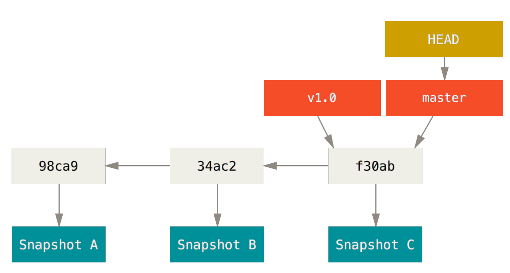
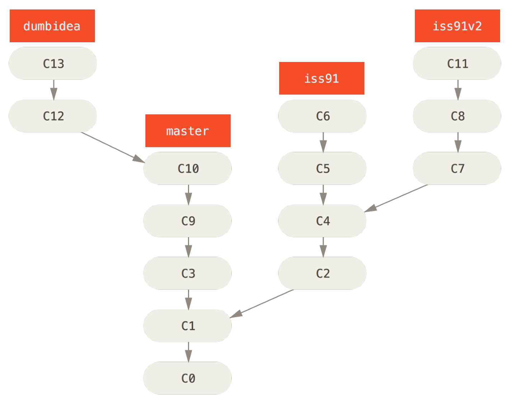
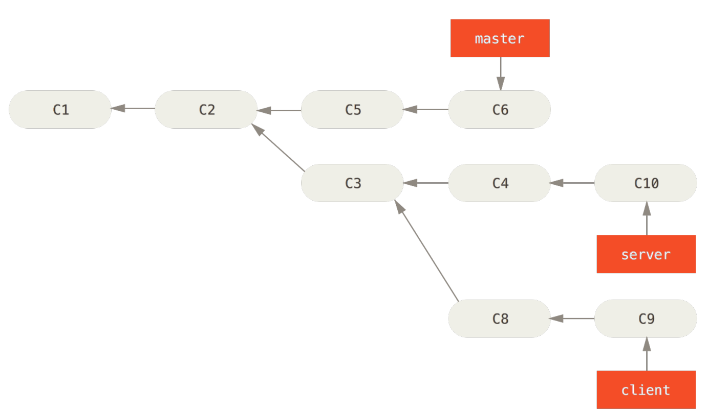

# 1 Git基础

## 1.1获取文件仓库

```shell
git init
```

该命令会创建一个名为.git的子目录

```shell
git clone [url] 
```

该命令会克隆该仓库服务器上所有数据，默认配置下的远程Git仓库中每一个文件的每一个版本都将会被拉取下来。

## 1.2 记录更新


文件状态：

- 已跟踪
  - 没有更改
  - 已更改
  - 放入暂存区
- 未跟踪

```shell
git status #查看文件状态
```

```shell
git add [file] #将文件进行跟踪
```

```shell
git mv file_from file_to #对文件进行重命名，如果直接重命名，git不会知道这是重命名的操作
```

```shell
git log #查看历史
git log -p -2 #最近两次的提交
```

补交漏掉的文件

```shell
git commit -m "initial commit"
git add forgetten_file
git commit --amend	#最终只会有一个提交，第二次提交将会代替第一次提交的结果
```

取消暂存或者修改的文件

```shell
git reset HEAD CONTRIBUTING.md #取消对CONTRIBUTING文件的暂存，
git checkout --CONTRIBUTING.md #取消对CONTRIBUTING文件的修改
```

## 1.3 远程仓库的使用

添加远程仓库

```shell
git remote add <shortname> <url>
```

```shell
git fetch [remote-name] #将数据拉取到本地仓库，但不会自动合并或修改当前工作文档
git pull [remote-name] #会自动抓取然后合并远程分支到当前分支
```

打标签，标签分为轻量标签和附注标签

附注标签是存储在git数据库中的一个完整对象，可以被校验，其中包含打标签的名字、电子邮件地址、日期时间

```shell
git tag -a v1.4 -m 'my version 1.4' #-a表示附注标签，-m表示指定了一条将会存储在标签中的信息
```

轻量标签本质上是将提交校验和存储到一个文件中，没有保存任何其他信息

```shell
git tag v1.4-lw
```

对过去提交打标签

```shell
git tag -a v1.2 9fceb02	#需要在命令的末尾指定提交的校验和（或部分校验和）
```

git 必须显式的推送标签

```shell
git push origin [tagname]
```


# 2 Git分支

## 2.1 分支新建与合并



<center style="color:#C0C0C0;text-decoration:underline">图2-1.分支及其提交历史</center>

### 2.1.1 创建分支

```shell
git branch testign
```


此时会创建一个新的分支testing，实际上就是创建了指针，git原理部分后文会详细介绍。但此时HEAD仍旧指向的是master，所以需要切换分支

### 2.1.2 切换分支

```shell
git checkout testing
```


此时HEAD指向了test分支

如果在master和testing分支分别提交一次，就可以看到如下


### 2.1.3 合并分支

假设现在有以下提交状况


如果要合并分支，则可以输入

```shell
git checkout master  	#切换到master分支
git merge iss53			#合并iss53和master
```


真正的合并过程如上图所示，会将master、iss53和两者的共同祖先进行比较，然后进行合并，合并也是产生新的节点，而不会进行删除，如下图


```shell
git branch -d iss53		#删除分支iss53
```

该命令无法删除还**没有合并**的分支

### 2.1.4 遇到冲突

如果遇到冲突，冲突文件内一般会有如下字段

```html
<<<<<<< HEAD:index.html
<div id="footer">contact : email.support@github.com</div>
=======
<div id="footer">
    please contact us at support@github.com
</div>
>>>>>>> iss53:index.html
```

这表示HEAD指向的版本，在这个区段的上半部分，（=======的上半部分），而iss53分支指向的版本在在下半部分。通常修改的办法是删除其中一个版本。

## 2.2 分支查看

```shell
git branch		#查看所有分支，带*表示HEAD所在分支
git branch -v 	#查看分支的最后一次的提交
git branch --mergeed	#查看已经合并的分支
git branch --no-merged 	#查看没有合并的分支
```


## 2.3 不同分支工作流

### 2.3.1 长期分支


只在master分支上保留完整的代码，剩下的分支用来做后续开发或者测试稳定性，这些分支不比保持绝对稳定，一旦达到稳定状态，它们就可以被合并入master分支了。

### 2.3.2 特性分支




特性分支对任何规模的项目都适用，这里先合并dumbidea分支，然后再删除【**如何用命令实现？**】

## 2.4 远程分支

### 2.4.1 远程分支介绍

远程引用是对远程仓库的引用（指针），包括分支、标签等等。可以通过`git ls-remote`显式地获得远程引用的完整列表。

远程跟踪分支是远程分支状态的引用，只有当做任何网络通信操作时，才会自动移动。


从远程仓库进行clone

如果此时有人向远程仓库推送了，但是你还没有更新，则会有如下状况


如果此时使用了`git fetch`,则会出现一下情况


如果此时存在一个远程仓库git.team1.ourcompany.com是git.ourcompany.com的子集，同时也fetch git.team1.ourcompany.com可以得到


### 2.4.2 推送

推送到origin仓库的serverfix分支

```shell
git push origin serverfix
```

git 将会serverfix分支展开成refs/heads/serverfix:refs/heads/serverfix，意思就是推送本地的serverfix分支来更新远程仓库的serverfix分支。

### 2.4.3 跟踪分支

跟踪分支是与远程分支有直接关系的本地分支，如果在一个跟踪分支上输入git pull，Git能够自动地识别去哪个服务器上抓取、合并到哪个分支。

当克隆可以仓库的时候，通常会自动的创造一个跟踪origin/master的master分支，也可以自己设置

```shell
git checkout -b [branch] [remotename]/[branch]
git checkout --track [remotename]/[branch]
git branch -vv			#查看设置的所有跟踪分支
```


```shell
$ git branch -vv
iss53 7e424c3 [origin/iss53: ahead 2] forgot the brackets
master 1ae2a45 [origin/master] deploying index fix
* serverfix f8674d9 [teamone/server-fix-good: ahead 3, behind 1] this should do it
testing 5ea463a trying something new
```

其中可以看出iss53分支正在跟踪origin/iss53并且"ahead"是2，意味着本地有两个提交还没有推送到服务器上。这只是与服务器上最后一次的抓取数据，如果要获取最新数据，则需要

```shell
git fetch --all
git branch -vv
```

### 2.4.4 拉取

```shell
git pull #相当于git fetch git merge两个命令合并
```

`git fetch`从服务器上抓取本地没有的数据，但是不会修改工作目录中的内容

### 2.4.5 删除远程分支

```shell
git push origin --delete serverfix
```


## 2.5 变基

### 2.5.1 普通变基操作

merge操作如下：


变基操作就是提取在C4中引入的补丁和修改，然后在C3的基础上在应用一次。可以使用rebase命令将提交某一分支的所有修改都移至另一分支上。

```shell
git checkout experiment
git rebase master
```

此时，分支如下


```shell
git checkout master
git merge experiment
```


变基和直接merge结果上没有什么区别，但是变基使得提交历史更加整洁。

### 2.5.2 跨分支变基

现有分支如下



如果要想将clien合并到主分支，但是不想合并server，可以通过一下命令

```shell
git rebase --onto master server client		#取出client分支，找出处于client分支和server分支的共同祖先之后的修改，然后把它们在master分支上重演一边
```

则会有以下分支效果


然后在进行分支合并

```shell
git checkout master
git merge client
```


再整合server和master

```shell
git checkout master
git merge server
```


```shell
git branch -d client
git branch -d server
```


### 2.5.3 变基的风险

**不要对在你的仓库外有副本的分支执行变基**。

只对尚未推送或分享给别人的本地修改执行变基操作清理历史。

# 3 分布式Git

## 3.1 分布式工作流

### 3.1.1 集中式工作流


一个中心仓库，可以接受代码，所有人将自己的工作与之同步。若干个开发者则作为节点--也就是中心仓库的消费者--并且与之进行同步。


### 3.1.2 集成管理者工作流


工作方式如下：

1. 项目维护者克隆此仓库
2. 贡献者克隆此仓库，做出修改
3. 贡献者将数据推送到自己的公开仓库
4. 贡献者给维护者发送邮件，请求拉取自己的更新
5. 维护者在自己本地的仓库中，将贡献者的仓库加为远程仓库并合并修改
6. 维护者将合并后的修改推送到主仓库

### 3.1.3 司令官与副官工作流


工作方式：

1. 普通开发者在自己的特性分支上工作，并根据master分支进行变基。这里是司令官的master分支
2. 副官将普通开发者的特性分支合并到自己的master分支中
3. 司令官将所有副官的master分支并入自己的master分支中
4. 司令官将集成后的master分支推送到参考仓库中，以便所有其他开发者以此为基础进行变基

## 3.2 提交准则

```shell
git diff --check
```

该命令用来检查空白错误，空白错误是指行尾的空格、Tab制表符，和行首空格后跟Tab制表符行为。

修改的说明

> 修改的摘要（25个汉字或更少）
>
> 
>
> 如果必要的话，加入更详细的解释文字。在大概36个汉字的时候换行。在某些情况下，
>
> 第一行被当做一封电子邮件的标题，剩下的文本作为正文。分隔摘要与正文的空行是
>
> 必须的；如果你将两者混淆，那么类似变基等工具将无法正常工作。

团队协作流程

1. git clone远程库
2. 编写文件，然后commit
3. git fetch将远程库进行同步
4. git log查看别人工作与自己是否冲突，解决冲突
5. git merge, 将别人的工作与自己的工作合并
6. git push推送到远程库

## 3.3 GitHub

### 3.3.1 Fork

如果你想要参与某个项目，但是没有推送权限，这时可以对这个项目进项fork，fork是指，GitHub将在你的空间中创建一个完全属于你的项目的副本，且你对其具有推送权限。

人们可以fork这个项目，将修改推送到派生出的项目副本中，并通过创建合并请求来让他们的改动进入源版本库。

fork过程


1. 将派生出的副本克隆到本地
2. 创建出名称有意义的分支
3. 修改代码
4. 检查改动
5. 将改动提交到分支
6. 将新分支推送到GitHub的副本中
